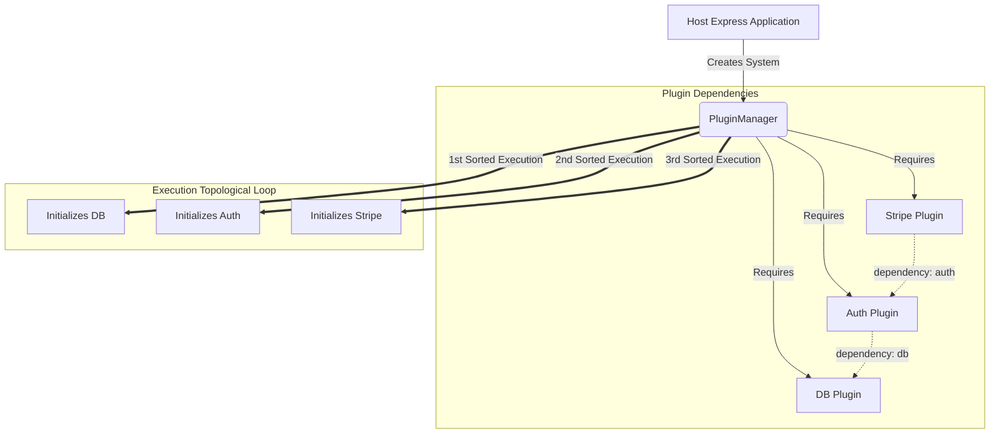

# Overview

XPlug operates purely on modular decoupling. When deploying XPlug inside a host network, the concept of a "Global Environment" is eradicated across Plugins. Instead, plugins interact purely through:

1. Requesting structural guarantees via `Dependencies`.
2. Providing capability logic via `Services`.
3. Integrating to the core via strictly permitted `Lifecycles`.

## Architectural DAG Pipeline

When you orchestrate `PluginManager.init()`, the core strictly calculates the correct topological insertion graph mapping what needs to exist prior to plugins running logic.



## Deep Integration

To successfully lock XPlug into a functional web application, observe the structural mapping of the `app.use` pipeline. XPlug natively controls routes securely wrapping them internally into `app.use(plugin.routeBasePath, scopedRouter)`.

```typescript
// Always strictly mount Middlewares before Routes directly inside your index startup
await xplugManager.mountMiddleware();
await xplugManager.mountRoutes();
```

> [!TIP]
> The engine maps Express dynamically under the hood! Middleware factories declared within `definePlugin` natively acquire access to the `PluginContext`. This allows HTTP endpoints explicit boundaries over the internal plugin State mechanisms and shared `serviceRegistries` identically mapped as if you were running inside a Native Hook.
